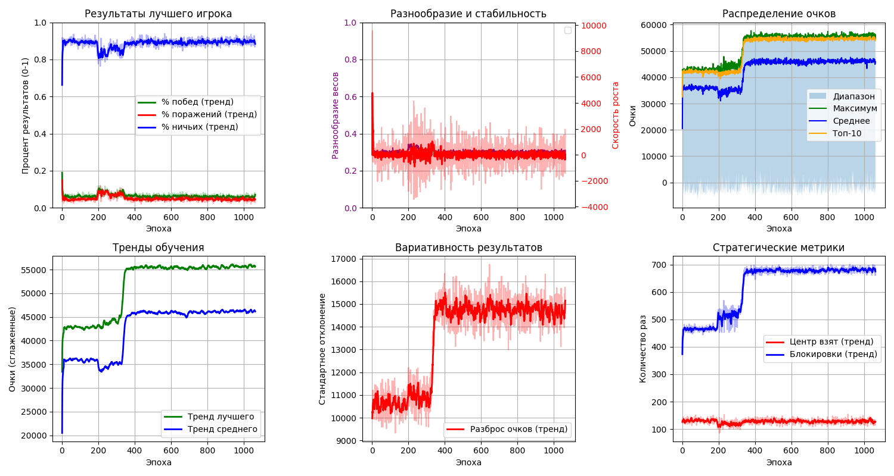

# Крестики-нолики с ИИ через генетический алгоритм

## О проекте
Это мой учебный проект, в котором я изучаю создание нейросетей с нуля и применение генетического алгоритма для их обучения на примере игры в крестики-нолики. Цель — самостоятельно разобраться, как строить и обучать нейросети, а также освоить генетический алгоритм. Проект создан для личного обучения и экспериментов с ИИ.

## Результаты обучения

*Статистика обучения нейросети: процент побед, скорость роста, разнообразие популяции и другие метрики за 1000+ эпох*

## Как работает
- Создается популяция ИИ-игроков с рандомными весами нейросети.
- ИИ соревнуются в турнирах, играя против случайных соперников из популяции.
- На основе результатов турнира лучшие игроки отбираются для следующего поколения. Учитываются:
  - **Победы, ничьи, поражения** - основные результаты игр.
  - **Взятие центра** - бонус за стратегически важную позицию.
  - **Блокировка противника** - бонус за предотвращение победы соперника.
- Генетический алгоритм:
  - Сохраняет лучших игроков (элита).
  - Создает новых игроков через скрещивание (кроссовер) и мутации.
  - Добавляет случайных игроков для разнообразия.
- После обучения лучшие ИИ сохраняются в `best.json` для дальнейшего дообучения.
- В конце выводятся детальные графики статистики и анимация весов нейросети

## Установка
- Требуется Python 3.
- Зависимости: стандартные библиотеки (`json`, `math`, `random`) и `matplotlib` для графиков, `pretty_errors` для удобного вывода ошибок.
- Установка: клонируйте репозиторий, установите зависимости через `pip install matplotlib pretty_errors`.

## Использование
1. Настройте параметры в `config.py` (размер популяции, количество эпох, вероятность мутаций и т.д.).
2. Запустите обучение - процесс можно прервать Ctrl+C с сохранением результатов
3. Анализируйте 6 графиков статистики: результаты, тренды, разнообразие, стратегические метрики
4. Просмотрите анимацию изменения весов нейросети по эпохам
5. Сыграйте против лучшего ИИ

## Оценка успеха
- Успех ИИ можно оценить по графикам: статистика побед, поражений и других метрик лучшего игрока.
- Лучший ИИ тестируется в 500 играх против случайного игрока, выводится процент побед/ничьих/поражений.
- Можно сыграть против ИИ, чтобы проверить его ходы на практике.

## Проблемы
- ИИ пока очень слабо обучается: он выигрывает чаще случайного игрока, но не демонстрирует сложных стратегий.
- Обучение медленное, требуется оптимизация алгоритма и нейросети.
